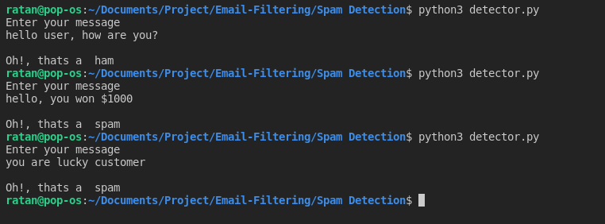

It is important to note that SPAM is not only annoying but also expensive. Today, many people check their inboxes using a cell-phone data plan. Every e-mail requires an amount of
data transfer, which the client must pay for. Additionally, SPAM costs money for Internet Service Providers (ISPs) as it is transmitted through their servers and other network
devices. Once we have considered this aspect of SPAM, we will want to avoid it to the maximum extent possible.

# 1. DATA DESCRIPTION

The SMS Spam Collection v.1 (hereafter the corpus) is a set of SMS tagged messages that have been collected for SMS Spam research. It contains one set of SMS messages in English of 5,574 messages, tagged acording being ham (legitimate) or spam. 

## 1.1. Compilation

This corpus has been collected from free or free for research sources at the Web:

- A collection of between 425 SMS spam messages extracted manually from the Grumbletext Web site. This is a UK forum in which cell phone users make public claims about SMS spam messages, most of them without reporting the very spam message received. The identification of the text of spam messages in the claims is a very hard and time-consuming task, and it involved carefully scanning hundreds of web pages. The Grumbletext Web site is: http://www.grumbletext.co.uk/
- A list of 450 SMS ham messages collected from Caroline Tag's PhD Theses available at http://etheses.bham.ac.uk/253/1/Tagg09PhD.pdf
- A subset of 3,375 SMS ham messages of the NUS SMS Corpus (NSC), which is a corpus of about 10,000 legitimate messages collected for research at the Department of Computer Science at the National University of Singapore. The messages largely originate from Singaporeans and mostly from students attending the University. These messages were collected from volunteers who were made aware that their contributions were going to be made publicly available. The NUS SMS Corpus is avalaible at: http://www.comp.nus.edu.sg/~rpnlpir/downloads/corpora/smsCorpus/
- The amount of 1,002 SMS ham messages and 322 spam messages extracted from the SMS Spam Corpus v.0.1 Big created by José María Gómez Hidalgo and public available at: http://www.esp.uem.es/jmgomez/smsspamcorpus/

## 1.2. Statistics

There is one collection:

- The SMS Spam Collection v.1 (text file: data) has a total of 4,827 SMS legitimate messages (86.6%) and a total of 747 (13.4%) spam messages.

## 1.3. Format

The files contain one message per line. Each line is composed by two columns: one with label (ham or spam) and other with the raw text. Here are some examples:

ham   What you doing?how are you?

ham   Ok lar... Joking wif u oni...

ham   dun say so early hor... U c already then say...

ham   MY NO. IN LUTON 0125698789 RING ME IF UR AROUND! H*

ham   Siva is in hostel aha:-.

ham   Cos i was out shopping wif darren jus now n i called him 2 ask wat present he wan lor. Then he started guessing who i was wif n he finally guessed darren lor.

spam   FreeMsg: Txt: CALL to No: 86888 & claim your reward of 3 hours talk time to use from your phone now! ubscribe6GBP/ mnth inc 3hrs 16 stop?txtStop

spam   Sunshine Quiz! Win a super Sony DVD recorder if you canname the capital of Australia? Text MQUIZ to 82277. B

spam   URGENT! Your Mobile No 07808726822 was awarded a L2,000 Bonus Caller Prize on 02/09/03! This is our 2nd attempt to contact YOU! Call 0871-872-9758 BOX95QU

Note: messages are not chronologically sorted.

## 1.4 About

The corpus has been collected by Tiago Agostinho de Almeida (http://www.dt.fee.unicamp.br/~tiago) and José María Gómez Hidalgo (http://www.esp.uem.es/jmgomez).

We would like to thank Dr. Min-Yen Kan (http://www.comp.nus.edu.sg/~kanmy/) and his team for making the NUS SMS Corpus available. See: http://www.comp.nus.edu.sg/~rpnlpir/downloads/corpora/smsCorpus/. He is currently collecting a bigger SMS corpus at: http://wing.comp.nus.edu.sg:8080/SMSCorpus/

# 2. DESCRIPTION

This project contains 3 main files:
<ul>
<li><b>data.csv : </b> It contains messages and class(spam/ham).</li>
<li><b>Model Selection.ipynb : </b> Here models were compaired and best dumped as <b>model.sav</b> along with <b>trainingVector.</b></li>
<li><b>detector.py : </b> This is main file which return the classification result of message from user input.</li>
</ul>

# 3. Screenshot

